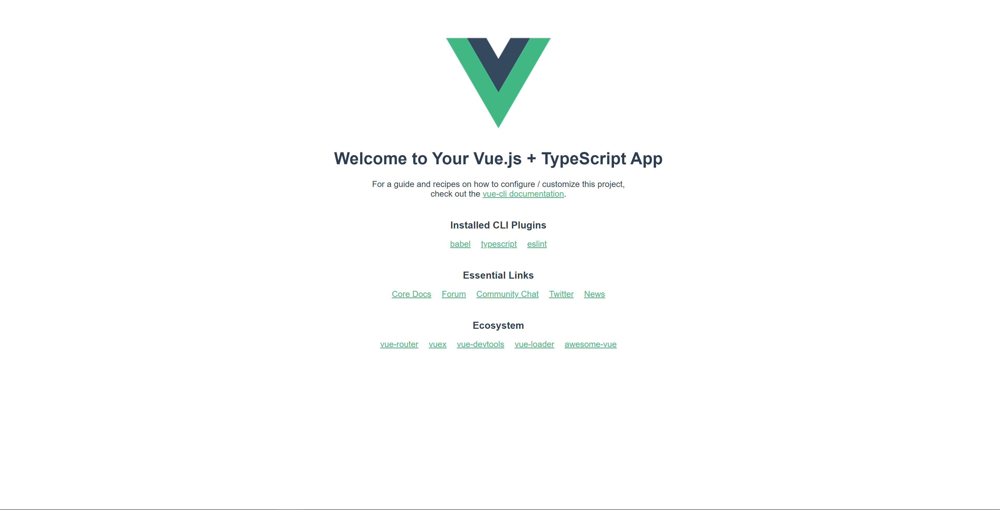

# Vue3 - Initial Structuring Process Steps - With TS

### 1. Node.js 安装 

https://nodejs.org/en/ 

目的：装载 npm 控制器


### 2. Vue3 架构流程

1. npm install -g @vue/cli （下载 Vue-cli which will set up a project structure and a workflow using Webpack (https://webpack.js.org/concepts/)）

2. https://cli.vuejs.org/zh/guide/

3. ``` bash
   # update
   vue upgrade --next
   ```

4. Create a directory ("Name of file")

5. ```bash
   1. vue create **name of app**						=> Enter
   2. > Manually select features 						=> Enter
   3. > () TypeScript  							=>SPACE	 => Enter
   4. > 3.x 							        => Enter
   5. ? Use class-style component syntax? (y/N)                            => N
   6. ? Use Babel alongside TypeScript (required for modern mode, auto-detected polyfills, transpiling JSX)? (Y/n) => Y 
   7. > ESLint with error prevention only				        => Enter
   8. > (*) Lint on save 						        => Enter
   9. > In dedicated config files						=> Enter
   10. ? Save this as a preset for future projects? (y/N)                  =>N
   ```

6. npm install && npm run serve (The step will test web is or not is working)

   

   7. npm install typescript --save-dev 

      目的安装typescript  项目中安装


### 3. Build Routing with vue-router

1. npm install (npm i)

2. run 'npm install --save vue-router@next'  (--save will add the module to our **package.json** -> which is dependency packages)

3. Then run 'npm install'

4. In **'main.ts'** import the router and add **'app.user(router)'** to link the router to our Vue object.

5. ```import { createWebHistory, createRouter } from 'vue-router'``` in a new router file

6. ``` vue
   // In new file calls router
   import { createWebHistory, createRouter } from 'vue-router'
   const routes = [{path: "/", redirect: '/home'},]
   const router = createRouter({
   routes,
   history: createWebHistory()
   })
   export default router;
   ```

7. ``` vue
   //In main.ts:
   import router from "./router";
   
   const app = createApp(App);
   
   app.use(router);// router 
   app.mount('#app');
   ```

8. See Details in https://v3.vuejs.org/guide/routing.html


### 4. Build Axios

1. npm install (npm i)

2. run 'npm install --save axios'  (--save will add the module to our **package.json** -> which is dependency packages)

3. Then run 'npm install'

4. Option: 

5. ``` vue
   // In new file call api
   import axios from 'axios';
   
   const SERVER_URL = "end-point-url"; // Example http://localhost:4941/api/v1/
   
   const instance = axios.create({
       baseURL: SERVER_URL,
       timeout: 1000
   });
   
   export default {
      login: (user) => instance.post('users/login', user),
   }
   ```

6. ```vue
   //In main.ts
   import Api from "./api";
   //....
   app.config.globalProperties.$api =Api;
   ...
   ```

7. See Details in https://vuejs.org/v2/cookbook/using-axios-to-consume-apis.html


### 5. Build our app to Element Plus

1. npm install (npm i)

2. run 'npm install --save element-plus'  (--save will add the module to our **package.json** -> which is dependency packages)

3. Then run 'npm install' 

4. ``` vue
   // In main.ts
   import ElementPlus from 'element-plus';
   .....
   app.use(ElementPlus);
   .....
   
   ```

5. ```html
   <!--In public index.html -->
   <!--In Head you can -->
   <!--unpkg -->
   <head>
     <!-- 导入样式 -->
     <link rel="stylesheet" href="//unpkg.com/element-plus/dist/index.css" />
     <!-- 导入 Vue 3 -->
     <script src="//unpkg.com/vue@next"></script>
     <!-- 导入组件库 -->
     <script src="//unpkg.com/element-plus"></script>
   </head>
   
   <!--jsDelivr -->
   <head>
     <!-- 导入样式 -->
     <link
       rel="stylesheet"
       href="//cdn.jsdelivr.net/npm/element-plus/dist/index.css"
     />
     <!-- 导入 Vue 3 -->
     <script src="//cdn.jsdelivr.net/npm/vue@next"></script>
     <!-- 导入组件库 -->
     <script src="//cdn.jsdelivr.net/npm/element-plus"></script>
   </head>
   
   <!--uni -->
   <head>
   <link rel="stylesheet" href="https://unpkg.com/element-plus@1.0.2-beta.41/lib/theme-chalk/index.css" crossorigin="anonymous">
   </head>
   ```